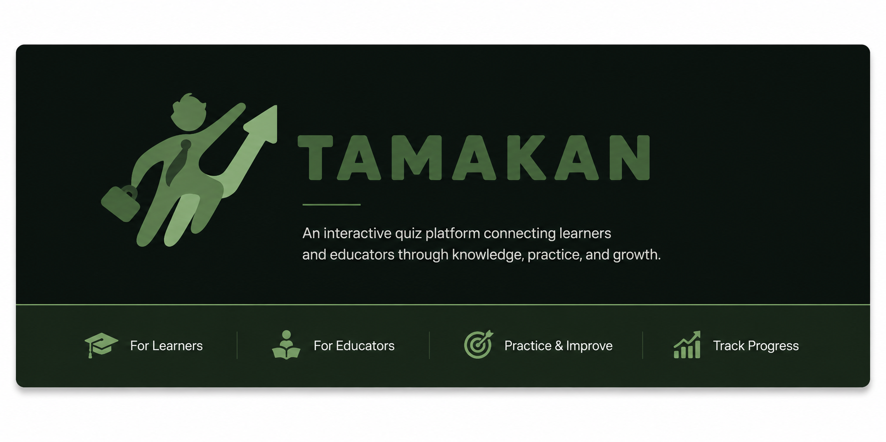
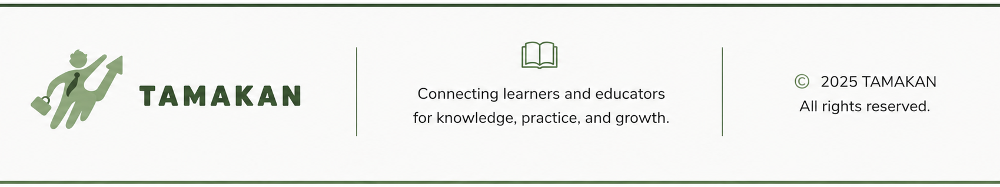

<p align="center">
  
</p>

# TAMAKAN

### Learn. Practice. Contribute. Improve.

**TAMAKAN** is an interactive web-based quiz platform that creates a collaborative learning environment between **learners** and **educators**.

The platform goes beyond the traditional quiz experience. Learners can discover quizzes by topic, answer multiple-choice questions, receive instant score-based feedback, rate quizzes, and recommend new questions. Educators can create and manage quiz content, monitor learner performance, read feedback, and review learner-submitted questions by approving or rejecting them with comments.

TAMAKAN turns a quiz from a one-way assessment into a **continuous learning and content-improvement cycle**.

---

## Project Idea

Most quiz platforms follow a simple model:

```text
Educator creates questions → Learner answers → Score is displayed
```

TAMAKAN expands this model by allowing learners to actively contribute to the learning content.

```text
Educator Creates Quiz
        ↓
Learner Takes Quiz
        ↓
Instant Score & Feedback
        ↓
Learner Rates the Quiz
        ↓
Learner Recommends a Question
        ↓
Educator Reviews the Recommendation
        ↓
Approve / Reject + Comment
        ↓
Learning Content Evolves
```

This creates a more interactive relationship between educators and learners and gives learners a meaningful role in improving quiz content.

---

## User Roles

TAMAKAN supports two primary roles.

### Learner

Learners can:

- Create an account and log in.
- Access a personalized learner homepage.
- Browse available quizzes.
- Filter quizzes by topic.
- View the educator responsible for a quiz.
- View the number of questions in each quiz.
- Take multiple-choice quizzes.
- Submit quiz answers.
- Receive an instant percentage score.
- Receive motivational feedback based on performance.
- Rate quizzes from 1 to 5.
- Submit written quiz feedback.
- Recommend new questions to educators.
- Choose a topic and educator for each recommendation.
- Add four answer choices and identify the correct answer.
- Upload an optional image with a recommended question.
- Track the status of submitted recommendations.
- View educator comments on recommendations.

### Educator

Educators can:

- Create an account and log in.
- Select specialized topics.
- Access an educator dashboard.
- View quizzes related to their topics.
- Add new quiz questions.
- Add optional question figures/images.
- Edit existing questions.
- Delete quiz questions.
- Manage question content dynamically.
- View the number of learners who completed a quiz.
- View average learner scores.
- View average quiz ratings.
- Read learner feedback.
- Review learner-recommended questions.
- Approve or reject recommendations.
- Leave comments for learners.

---

## Key Features

### Topic-Based Quiz Discovery

Quizzes are organized by topic to make learning content easier to explore.

Learners can dynamically filter available quizzes and focus on topics relevant to their interests or learning goals.

### Interactive Quiz Experience

Each quiz contains multiple-choice questions with four answer choices:

```text
A
B
C
D
```

Questions may also include visual figures when needed.

### Instant Scoring

When a learner submits a quiz, TAMAKAN calculates the result as a percentage and stores the completed attempt.

The feedback changes according to the learner's score:

| Score | Experience |
|---|---|
| **80% and above** | Excellent performance / applause feedback |
| **50% – 79%** | Encouraging “keep going” feedback |
| **Below 50%** | Review and try again feedback |

The result page also uses motivational media to make the scoring experience more engaging.

### Quiz Ratings & Feedback

After completing a quiz, learners can:

- Rate the quiz.
- Submit an optional written comment.

Educators can use this information to understand how learners perceive their quizzes and identify opportunities for improvement.

### Learner Question Recommendations

A distinctive feature of TAMAKAN is its learner contribution workflow.

Learners can propose a new question containing:

- Topic
- Educator
- Question text
- Optional image
- Four possible answers
- Correct answer

Each submission starts as a **pending recommendation**.

### Educator Review Workflow

Educators can review learner recommendations and:

- Approve the question.
- Reject the question.
- Add a review comment.

This creates direct feedback between the two roles and supports continuous improvement of the educational content.

---

## Authentication & Access Control

TAMAKAN uses role-based authentication for learners and educators.

The platform uses sessions to:

- Keep users signed in.
- Identify the active user.
- Redirect each role to the correct experience.
- Protect pages based on user type.

Passwords created through the registration workflow are securely hashed before being stored.

---

## Database Design

TAMAKAN uses a relational **MySQL** database.

### Main Tables

| Table | Purpose |
|---|---|
| `user` | Stores learner and educator accounts |
| `topic` | Stores educational topics |
| `quiz` | Connects quizzes, educators, and topics |
| `quizquestion` | Stores quiz questions and answer choices |
| `takenquiz` | Stores completed quiz attempts and scores |
| `quizfeedback` | Stores learner ratings and comments |
| `recommendedquestion` | Stores learner question recommendations and educator reviews |

### Simplified Relationships

```text
                Topic
                  |
                  v
Educator ------> Quiz
                  |
        ┌─────────┼────────────┐
        v         v            v
  QuizQuestion  TakenQuiz  QuizFeedback

Learner ----------------------+
   |
   v
RecommendedQuestion
   |
   v
Educator Review
```

---

## Technologies

### Server-Side

- PHP
- PHP Sessions
- PDO
- MySQLi

### Database

- MySQL

### User Interface

- HTML5
- CSS3
- JavaScript
- jQuery
- Font Awesome
- Boxicons

### Dynamic Interaction

- AJAX
- Fetch API

---

## Repository Structure

```text
TAMAKAN/
│
├── pages/
│   ├── auth/
│   │   ├── index.php
│   │   ├── Auth.php
│   │   └── logout.php
│   │
│   ├── learner/
│   │   ├── learnerHome.php
│   │   ├── quiz.php
│   │   ├── takequiz.php
│   │   ├── score.php
│   │   └── recommend_question.php
│   │
│   └── educator/
│       ├── educatorHome.php
│       ├── AddQ.php
│       ├── editQ.php
│       └── Comments.php
│
├── actions/
│   ├── learner/
│   │   ├── submit_feedback.php
│   │   ├── submit_recommendation.php
│   │   └── add_recommendation.php
│   │
│   └── educator/
│       ├── addQ_process.php
│       ├── editQ_process.php
│       ├── delete_question.php
│       └── delete_question_ajax.php
│
├── api/
│   ├── get_quizzes.php
│   └── get_educators_by_topic.php
│
├── includes/
│   ├── header.php
│   ├── footer.php
│   └── ...
│
├── assets/
│   ├── css/
│   ├── js/
│   ├── images/
│   └── videos/
│
├── storage/
│   └── uploads/
│
├── database/
│   └── tamakan.sql
│
├── docs/
│   └── screenshots/
│
├── .gitignore
└── README.md
```

---

## How TAMAKAN Works

### Learner Flow

```text
Sign Up / Login
      ↓
Browse Quizzes
      ↓
Filter by Topic
      ↓
Take Quiz
      ↓
Submit Answers
      ↓
View Score & Motivational Feedback
      ↓
Rate the Quiz
      ↓
Recommend a New Question
      ↓
Track Educator Review
```

### Educator Flow

```text
Sign Up / Login
      ↓
Access Topic Quizzes
      ↓
Add / Edit / Delete Questions
      ↓
Monitor Scores & Ratings
      ↓
Read Learner Feedback
      ↓
Review Recommended Questions
      ↓
Approve / Reject + Comment
```

---

## Why TAMAKAN?

TAMAKAN is built around the idea that learners should be active participants in the learning process.

Its value comes from combining:

- **Assessment** — learners practice through quizzes.
- **Immediate feedback** — learners immediately understand their performance.
- **Engagement** — motivational feedback makes results more interactive.
- **Communication** — learners can provide ratings and written feedback.
- **Contribution** — learners can propose their own questions.
- **Educator control** — educators retain responsibility for reviewing and managing content.
- **Continuous improvement** — quiz content can evolve through learner participation.

---

## Team Members

- **Nora Alkhudair**
- **Leen Aldbays**
- **Maria Alnafisah**
- **Lamees Alsaleh**

---

<p align="center">
  
</p>
